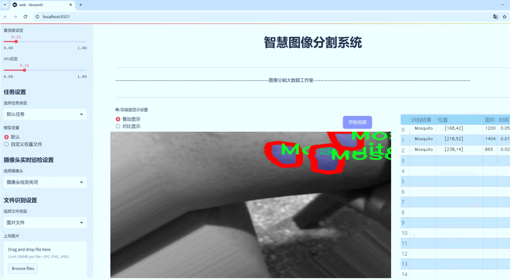

# 皮肤蚊虫叮咬区域图像分割系统： yolov8-seg-C2f-DySnakeConv

### 1.研究背景与意义

[参考博客](https://gitee.com/YOLOv8_YOLOv11_Segmentation_Studio/projects)

[博客来源](https://kdocs.cn/l/cszuIiCKVNis)

研究背景与意义

随着全球气候变化和城市化进程的加快，蚊虫叮咬所引发的公共卫生问题日益严重。蚊虫不仅是多种传染病的传播媒介，如登革热、疟疾和寨卡病毒等，而且其叮咬引发的过敏反应和皮肤病变也对人们的生活质量造成了显著影响。因此，针对蚊虫叮咬区域的有效识别与处理，成为了医学、生态学和计算机视觉等多个领域研究的热点之一。

在这一背景下，图像分割技术的应用显得尤为重要。图像分割是计算机视觉中的一项基本任务，其目标是将图像分割成多个有意义的区域，以便于后续的分析和处理。近年来，深度学习技术的迅猛发展为图像分割提供了新的思路和方法。其中，YOLO（You Only Look Once）系列模型因其高效的实时检测能力而受到广泛关注。YOLOv8作为该系列的最新版本，具备了更强的特征提取能力和更快的处理速度，为复杂场景下的目标检测和分割提供了良好的基础。

本研究旨在基于改进的YOLOv8模型，构建一个高效的皮肤蚊虫叮咬区域图像分割系统。我们将使用“Bug Bite 2”数据集，该数据集包含1200张图像，涵盖了六种不同的蚊虫类别，包括蚂蚁、跳蚤、蚊子、无、蜘蛛和蜱虫。这一数据集的多样性和丰富性为模型的训练和验证提供了坚实的基础。通过对这些图像进行实例分割，我们能够准确识别出不同类型的蚊虫叮咬区域，并为后续的医学研究和防治措施提供数据支持。

本研究的意义不仅在于提升蚊虫叮咬区域的识别精度，还在于推动计算机视觉技术在生物医学领域的应用。通过对蚊虫叮咬区域的精确分割，我们可以更好地理解不同蚊虫叮咬对皮肤的影响，进而为相关疾病的预防和治疗提供科学依据。此外，该系统的开发也为其他类型的生物图像分析提供了参考，具有广泛的应用前景。

综上所述，基于改进YOLOv8的皮肤蚊虫叮咬区域图像分割系统的研究，不仅具有重要的理论价值，也具备显著的实际应用意义。通过深入探索图像分割技术在公共卫生领域的应用，我们希望能够为蚊虫叮咬的监测、预防和治疗提供新的思路和方法，进而为人类健康保驾护航。

### 2.图片演示




注意：本项目提供完整的训练源码数据集和训练教程,由于此博客编辑较早,暂不提供权重文件（best.pt）,需要按照6.训练教程进行训练后实现上图效果。

### 3.视频演示

[3.1 视频演示](https://www.bilibili.com/video/BV1ViUUYWE55/)

### 4.数据集信息

##### 4.1 数据集类别数＆类别名

nc: 6
names: ['Ants', 'Fleas', 'Mosquito', 'None', 'Spider', 'Tick']


##### 4.2 数据集信息简介

数据集信息展示

在本研究中，我们使用了名为“Bug Bite 2”的数据集，旨在改进YOLOv8-seg模型在皮肤蚊虫叮咬区域图像分割任务中的表现。该数据集专门针对与皮肤叮咬相关的昆虫进行标注，涵盖了六个主要类别，分别是“Ants”（蚂蚁）、“Fleas”（跳蚤）、“Mosquito”（蚊子）、“None”（无叮咬）、“Spider”（蜘蛛）和“Tick”（蜱虫）。这些类别的选择不仅反映了常见的皮肤叮咬昆虫类型，还考虑到了不同昆虫在叮咬后可能造成的皮肤反应，从而为模型提供了丰富的训练样本。

“Bug Bite 2”数据集的构建过程涉及多种图像采集技术，确保了数据的多样性和代表性。数据集中的图像来源于不同的环境和光照条件，涵盖了各种皮肤类型和叮咬反应。这种多样性使得模型在训练过程中能够学习到不同情况下的特征，从而提高其在实际应用中的鲁棒性和准确性。每个类别的图像均经过精确标注，确保模型能够有效识别和分割出特定的叮咬区域。

在数据集的使用过程中，我们特别关注了图像的质量和分辨率，以确保模型能够捕捉到细微的特征变化。高分辨率的图像不仅有助于提高分割精度，还能为后续的分析提供更为详尽的信息。例如，在蚊子叮咬的图像中，模型需要识别出叮咬后皮肤的红肿区域，而在跳蚤叮咬的情况下，可能需要关注到不同的皮肤反应特征。这种针对性的训练将有助于模型在处理实际应用场景时，能够更准确地进行图像分割。

此外，数据集中的“None”类别起到了重要的对比作用，帮助模型学习到何时不应将某个区域标记为叮咬区域。这一类别的存在不仅增强了模型的判别能力，还减少了误报的可能性，从而提高了整体的分割效果。通过对不同类别的综合训练，模型能够在面对复杂的背景和多样的叮咬特征时，依然保持较高的识别率。

为了确保数据集的有效性和可靠性，我们在数据预处理阶段进行了多项操作，包括图像增强、归一化处理和数据扩增。这些步骤不仅提升了数据集的质量，还增加了模型的泛化能力，使其能够适应不同的应用场景。通过对“Bug Bite 2”数据集的深入分析和使用，我们期望能够显著提升YOLOv8-seg在皮肤蚊虫叮咬区域图像分割任务中的表现，为相关领域的研究和应用提供更为强大的技术支持。

总之，“Bug Bite 2”数据集为本研究提供了一个坚实的基础，凭借其丰富的类别和高质量的图像，能够有效地支持YOLOv8-seg模型的训练与优化。通过对该数据集的深入挖掘和应用，我们相信能够在皮肤蚊虫叮咬区域的图像分割领域取得突破性进展。


### 5.项目依赖环境部署教程（零基础手把手教学）

[5.1 环境部署教程链接（零基础手把手教学）](https://www.bilibili.com/video/BV1jG4Ve4E9t/?vd_source=bc9aec86d164b67a7004b996143742dc)


[5.2 安装Python虚拟环境创建和依赖库安装视频教程链接（零基础手把手教学）](https://www.bilibili.com/video/BV1nA4VeYEze/?vd_source=bc9aec86d164b67a7004b996143742dc)

### 6.手把手YOLOV8-seg训练视频教程（零基础手把手教学）

[6.1 手把手YOLOV8-seg训练视频教程（零基础小白有手就能学会）](https://www.bilibili.com/video/BV1cA4VeYETe/?vd_source=bc9aec86d164b67a7004b996143742dc)


按照上面的训练视频教程链接加载项目提供的数据集，运行train.py即可开始训练



     Epoch   gpu_mem       box       obj       cls    labels  img_size
     1/200     0G   0.01576   0.01955  0.007536        22      1280: 100%|██████████| 849/849 [14:42<00:00,  1.04s/it]
               Class     Images     Labels          P          R     mAP@.5 mAP@.5:.95: 100%|██████████| 213/213 [01:14<00:00,  2.87it/s]
                 all       3395      17314      0.994      0.957      0.0957      0.0843

     Epoch   gpu_mem       box       obj       cls    labels  img_size
     2/200     0G   0.01578   0.01923  0.007006        22      1280: 100%|██████████| 849/849 [14:44<00:00,  1.04s/it]
               Class     Images     Labels          P          R     mAP@.5 mAP@.5:.95: 100%|██████████| 213/213 [01:12<00:00,  2.95it/s]
                 all       3395      17314      0.996      0.956      0.0957      0.0845

     Epoch   gpu_mem       box       obj       cls    labels  img_size
     3/200     0G   0.01561    0.0191  0.006895        27      1280: 100%|██████████| 849/849 [10:56<00:00,  1.29it/s]
               Class     Images     Labels          P          R     mAP@.5 mAP@.5:.95: 100%|███████   | 187/213 [00:52<00:00,  4.04it/s]
                 all       3395      17314      0.996      0.957      0.0957      0.0845


### 7.50+种全套YOLOV8-seg创新点加载调参实验视频教程（一键加载写好的改进模型的配置文件）

[7.1 50+种全套YOLOV8-seg创新点加载调参实验视频教程（一键加载写好的改进模型的配置文件）](https://www.bilibili.com/video/BV1Hw4VePEXv/?vd_source=bc9aec86d164b67a7004b996143742dc)

### YOLOV8-seg算法简介

原始YOLOv8-seg算法原理

YOLOv8-seg算法是YOLO系列的最新进展，专注于目标检测与分割任务的结合，展现了在实时处理和高精度检测方面的显著优势。作为一种一阶段目标检测算法，YOLOv8-seg将目标检测与语义分割的任务整合在一个统一的框架中，通过优化网络结构和引入新的技术手段，提升了模型的性能和应用灵活性。

YOLOv8-seg的基本原理依然遵循YOLO系列的核心思想，即将目标检测问题转化为回归问题。与传统的目标检测方法不同，YOLOv8-seg不再依赖于预定义的锚框，而是采用了一种Anchor-free的检测方式。这种方法直接预测目标的中心点及其宽高比例，使得模型能够更快速地聚焦于目标的位置，减少了锚框选择和调整的复杂性。通过这种回归方式，YOLOv8-seg能够有效地处理不同尺度和形状的目标，提高了检测的准确性和速度。

在网络结构方面，YOLOv8-seg由四个主要部分组成：输入端、主干网络（backbone）、特征增强网络（neck）和检测头（head）。输入端采用了马赛克数据增强技术，这种技术通过将多张图像拼接在一起，增加了数据的多样性，提升了模型的泛化能力。自适应锚框计算和自适应灰度填充则进一步优化了输入数据的处理，确保模型能够在各种条件下保持高效的检测性能。

主干网络采用了CSPDarknet结构，结合了C2f模块和快速空间金字塔池化（SPPF）技术。C2f模块通过将输入特征图分成多个分支并进行卷积处理，增强了特征的表达能力和梯度流动。这种结构的引入，使得YOLOv8-seg在特征提取阶段能够获取更丰富的信息，进而提升后续的目标检测和分割效果。SPPF结构则通过提取不同尺度的特征，减少了模型的参数量和计算量，提高了特征提取的效率。

特征增强网络采用了路径聚合网络（PAN）结构，旨在加强不同尺度对象的特征融合能力。PAN通过多层卷积和池化操作，处理和压缩特征图，确保在不同层次上都能有效捕捉到目标的特征信息。这种结构的设计使得YOLOv8-seg能够在复杂场景中，尤其是存在多种尺度和形状的目标时，保持高效的检测和分割性能。

检测头部分则是YOLOv8-seg的关键所在，它将分类和回归任务解耦，形成两个独立的分支。通过这种解耦设计，模型能够更专注于各自的任务，从而提高了在复杂场景下的定位精度和分类准确性。分类分支采用了二元交叉熵损失（BCELoss），而回归分支则结合了分布焦点损失（DFLoss）和完全交并比损失函数（CIOULoss），进一步提升了边界框预测的精准性。

YOLOv8-seg在分割任务中引入了语义分割的概念，通过对目标区域的像素级别分类，实现了更为细致的目标分割。这一过程不仅依赖于目标的边界框信息，还结合了特征图中的上下文信息，使得模型能够在复杂背景下更准确地识别和分割目标。通过将目标检测与语义分割相结合，YOLOv8-seg在处理复杂场景时展现出了更强的适应性和鲁棒性。

总的来说，YOLOv8-seg算法通过创新的网络结构和高效的特征处理方法，成功地将目标检测与分割任务整合在一起。其Anchor-free的检测方式、解耦的检测头设计以及高效的特征提取能力，使得YOLOv8-seg在实时检测和高精度分割方面都表现出色。随着YOLOv8-seg的不断发展和应用，其在智能监控、自动驾驶、医疗影像分析等领域的潜力将会得到进一步的挖掘和实现。通过持续的优化和改进，YOLOv8-seg无疑将成为目标检测与分割领域的重要工具，为相关研究和应用提供强有力的支持。


### 9.系统功能展示（检测对象为举例，实际内容以本项目数据集为准）

图9.1.系统支持检测结果表格显示

  图9.2.系统支持置信度和IOU阈值手动调节

  图9.3.系统支持自定义加载权重文件best.pt(需要你通过步骤5中训练获得)

  图9.4.系统支持摄像头实时识别

  图9.5.系统支持图片识别

  图9.6.系统支持视频识别

  图9.7.系统支持识别结果文件自动保存

  图9.8.系统支持Excel导出检测结果数据


### 10.50+种全套YOLOV8-seg创新点原理讲解（非科班也可以轻松写刊发刊，V11版本正在科研待更新）

#### 10.1 由于篇幅限制，每个创新点的具体原理讲解就不一一展开，具体见下列网址中的创新点对应子项目的技术原理博客网址【Blog】：


[10.1 50+种全套YOLOV8-seg创新点原理讲解链接](https://gitee.com/qunmasj/good)

#### 10.2 部分改进模块原理讲解(完整的改进原理见上图和技术博客链接)【如果此小节的图加载失败可以通过CSDN或者Github搜索该博客的标题访问原始博客，原始博客图片显示正常】
### YOLOv8简介

YOLOv8是一种最新的SOTA算法，提供了N/S/M/L/X尺度的不同大小模型，以满足不同场景的需求。本章对算法网络的新特性进行简要介绍。


1）骨干网络和Neck
开发者设计了C2f模块对CSPDarkNet 53和PAFPN进行改造。相比C3模块，C2f模块拥有更多的分支跨层链接，使模型的梯度流更加丰富，显著增强了模型的特征提取能力。
2)Head部分
Head部分采用无锚框设计，将分类任务和回归任务进行了解耦，独立的分支将更加专注于其所负责的特征信息。
3）损失计算
模型使用CIOU Loss作为误差损失函数，并通过最小化DFL进一步提升边界框的回归精度。同时模型采用了TaskAlignedAssigner样本分配策略，以分类得分和IOU的高阶组合作为指标指导正负样本选择，实现了高分类得分和高IOU的对齐，有效地提升了模型的检测精度。


### D-LKA Attention简介
自2010年代中期以来，卷积神经网络（CNNs）已成为许多计算机视觉应用的首选技术。它们能够从原始数据中自动提取复杂的特征表示，无需手动进行特征工程，这引起了医学图像分析社区的极大兴趣。许多成功的CNN架构，如U-Net、全卷积网络、DeepLab或SegCaps（分割胶囊），已经被开发出来。这些架构在语义分割任务中取得了巨大成功，先前的最新方法已经被超越。

在计算机视觉研究中，不同尺度下的目标识别是一个关键问题。在CNN中，可检测目标的大小与相应网络层的感受野尺寸密切相关。如果一个目标扩展到超出这个感受野的边界，这可能会导致欠分割结果。相反，与目标实际大小相比使用过大的感受野可能会限制识别，因为背景信息可能会对预测产生不必要的影响。

解决这个问题的一个有希望的方法涉及在并行使用具有不同尺寸的多个Kernel，类似于Inception块的机制。然而，由于参数和计算要求的指数增长，将Kernel大小增加以容纳更大的目标在实践中受到限制。因此，出现了各种策略，包括金字塔池化技术和不同尺度的扩张卷积，以捕获多尺度的上下文信息。

另一个直观的概念涉及将多尺度图像金字塔或它们的相关特征表示直接纳入网络架构。然而，这种方法存在挑战，特别是在管理训练和推理时间方面的可行性方面存在挑战。在这个背景下，使用编码器-解码器网络，如U-Net，已被证明是有利的。这样的网络在较浅的层中编码外观和位置，而在更深的层中，通过神经元的更广泛的感受野捕获更高的语义信息和上下文信息。

一些方法将来自不同层的特征组合在一起，或者预测来自不同尺寸的层的特征以使用多尺度的信息。此外，出现了从不同尺度的层中预测特征的方法，有效地实现了跨多个尺度的见解整合。然而，大多数编码器-解码器结构面临一个挑战：它们经常无法在不同尺度之间保持一致的特征，并主要使用最后一个解码器层生成分割结果。

语义分割是一项任务，涉及根据预定义的标签集为图像中的每个像素预测语义类别。这项任务要求提取高级特征同时保留初始的空间分辨率。CNNs非常适合捕获局部细节和低级信息，尽管以忽略全局上下文为代价。视觉Transformer（ViT）架构已经成为解决处理全局信息的视觉任务的关键，包括语义分割，取得了显著的成功。

ViT的基础是注意力机制，它有助于在整个输入序列上聚合信息。这种能力使网络能够合并远程的上下文提示，超越了CNN的有限感受野尺寸。然而，这种策略通常会限制ViT有效建模局部信息的能力。这种局限可能会妨碍它们检测局部纹理的能力，这对于各种诊断和预测任务至关重要。这种缺乏局部表示可以归因于ViT模型处理图像的特定方式。

ViT模型将图像分成一系列Patch，并使用自注意力机制来模拟它们之间的依赖关系。这种方法可能不如CNN模型中的卷积操作对感受野内提取局部特征有效。ViT和CNN模型之间的这种图像处理方法的差异可能解释了CNN模型在局部特征提取方面表现出色的原因。

近年来，已经开发出创新性方法来解决Transformer模型内部局部纹理不足的问题。其中一种方法是通过互补方法将CNN和ViT特征结合起来，以结合它们的优势并减轻局部表示的不足。TransUNet是这种方法的早期示例，它在CNN的瓶颈中集成了Transformer层，以模拟局部和全局依赖关系。HiFormer提出了一种解决方案，将Swin Transformer模块和基于CNN的编码器结合起来，生成两个多尺度特征表示，通过Double-Level Fusion模块集成。UNETR使用基于Transformer的编码器和CNN解码器进行3D医学图像分割。CoTr和TransBTS通过Transformer在低分辨率阶段增强分割性能，将CNN编码器和解码器连接在一起。

增强局部特征表示的另一种策略是重新设计纯Transformer模型内部的自注意力机制。在这方面，Swin-Unet在U形结构中集成了一个具有线性计算复杂性的Swin Transformer块作为多尺度 Backbone 。MISSFormer采用高效Transformer来解决视觉Transformer中的参数问题，通过在输入块上进行不可逆的降采样操作。D-Former引入了一个纯Transformer的管道，具有双重注意模块，以分段的方式捕获细粒度的局部注意和与多元单元的交互。然而，仍然存在一些特定的限制，包括计算效率低下，如TransUNet模型所示，对CNN Backbone 的严重依赖，如HiFormer所观察到的，以及对多尺度信息的忽略。

此外，目前的分割架构通常采用逐层处理3D输入 volumetric 的方法，无意中忽视了相邻切片之间的潜在相关性。这一疏忽限制了对 volumetric 信息的全面利用，因此损害了定位精度和上下文集成。此外，必须认识到，医学领域的病变通常在形状上发生变形。因此，用于医学图像分析的任何学习算法都必须具备捕捉和理解这些变形的能力。与此同时，该算法应保持计算效率，以便处理3D volumetric数据。

为了解决上述提到的挑战，作者提出了一个解决方案，即可变形大卷积核注意力模块（Deformable LKA module），它是作者网络设计的基本构建模块。这个模块明确设计成在有效处理上下文信息的同时保留局部描述符。作者的架构在这两个方面的平衡增强了实现精确语义分割的能力。

值得注意的是，参考该博客引入了一种基于数据的感受野的动态适应，不同于传统卷积操作中的固定滤波器Mask。这种自适应方法使作者能够克服与静态方法相关的固有限制。这种创新方法还扩展到了D-LKA Net架构的2D和3D版本的开发。

在3D模型的情况下，D-LKA机制被量身定制以适应3D环境，从而实现在不同 volumetric 切片之间无缝信息交互。最后，作者的贡献通过其计算效率得到进一步强调。作者通过仅依靠D-LKA概念的设计来实现这一点，在各种分割基准上取得了显著的性能，确立了作者的方法作为一种新的SOTA方法。

在本节中，作者首先概述方法论。首先，作者回顾了由Guo等人引入的大卷积核注意力（Large Kernel Attention，LKA）的概念。然后，作者介绍了作者对可变形LKA模块的创新探索。在此基础上，作者介绍了用于分割任务的2D和3D网络架构。

大卷积核提供了与自注意力机制类似的感受野。可以通过使用深度卷积、深度可扩展卷积和卷积来构建大卷积核，从而减少了参数和计算量。构建输入维度为和通道数的卷积核的深度卷积和深度可扩展卷积的卷积核大小的方程如下：


具有卷积核大小和膨胀率。参数数量和浮点运算（FLOPs）的计算如下：


FLOPs的数量与输入图像的大小成线性增长。参数的数量随通道数和卷积核大小的增加而呈二次增长。然而，由于它们通常都很小，因此它们不是限制因素。

为了最小化对于固定卷积核大小K的参数数量，可以将方程3对于膨胀率的导数设定为零：


例如，当卷积核大小为时，结果是。将这些公式扩展到3D情况是直接的。对于大小为和通道数C的输入，3D情况下参数数量和FLOPs 的方程如下：


具有卷积核大小和膨胀。


利用大卷积核进行医学图像分割的概念通过引入可变形卷积得以扩展。可变形卷积可以通过整数偏移自由调整采样网格以进行自由变形。额外的卷积层从特征图中学习出变形，从而创建一个偏移场。基于特征本身学习变形会导致自适应卷积核。这种灵活的卷积核形状可以提高病变或器官变形的表示，从而增强了目标边界的定义。

负责计算偏移的卷积层遵循其相应卷积层的卷积核大小和膨胀。双线性插值用于计算不在图像网格上的偏移的像素值。如图2所示，D-LKA模块可以表示为：


其中输入特征由表示，。表示为注意力图，其中每个值表示相应特征的相对重要性。运算符  表示逐元素乘法运算。值得注意的是，LKA不同于传统的注意力方法，它不需要额外的规范化函数，如或。这些规范化函数往往忽视高频信息，从而降低了基于自注意力的方法的性能。

在该方法的2D版本中，卷积层被可变形卷积所替代，因为可变形卷积能够改善对具有不规则形状和大小的目标的捕捉能力。这些目标在医学图像数据中常常出现，因此这种增强尤为重要。

然而，将可变形LKA的概念扩展到3D领域会带来一定的挑战。主要的约束来自于需要用于生成偏移的额外卷积层。与2D情况不同，由于输入和输出通道的性质，这一层无法以深度可分的方式执行。在3D环境中，输入通道对应于特征，而输出通道扩展到，其中是卷积核的大小。大卷积核的复杂性导致沿第3D的通道数扩展，导致参数和FLOPs大幅增加。因此，针对3D情况采用了另一种替代方法。在现有的LKA框架中，深度卷积之后引入了一个单独的可变形卷积层。这种战略性的设计调整旨在减轻扩展到3D领域所带来的挑战。


2D网络的架构如图1所示。第一变种使用MaxViT作为编码器组件，用于高效特征提取，而第二变种则结合可变形LKA层进行更精细、卓越的分割。

在更正式的描述中，编码器生成4个分层输出表示。首先，卷积干扰将输入图像的维度减小到。随后，通过4个MaxViT块的4个阶段进行特征提取，每个阶段后跟随降采样层。随着过程进展到解码器，实施了4个阶段的D-LKA层，每个阶段包含2个D-LKA块。然后，应用Patch扩展层以实现分辨率上采样，同时减小通道维度。最后，线性层负责生成最终的输出。

2D D-LKA块的结构包括LayerNorm、可变形LKA和多层感知器（MLP）。积分残差连接确保了有效的特征传播，即使在更深层也是如此。这个安排可以用数学方式表示为：


其中输入特征，层归一化LN，可变形LKA注意力，深度卷积，线性层和GeLU激活函数。

3D网络架构如图1所示，采用编码器-解码器设计进行分层结构化。首先，一个Patch嵌入层将输入图像的维度从（）减小到（）。在编码器中，采用了3个D-LKA阶段的序列，每个阶段包含3个D-LKA块。在每个阶段之后，通过降采样步骤将空间分辨率减半，同时将通道维度加倍。中央瓶颈包括另一组2个D-LKA块。解码器结构与编码器相对称。

为了将特征分辨率加倍，同时减少通道数，使用转置卷积。每个解码器阶段都使用3个D-LKA块来促进远距离特征依赖性。最终的分割输出由一个卷积层产生，后面跟随一个卷积层以匹配特定类别的通道要求。

为了建立输入图像和分割输出之间的直接连接，使用卷积形成了一个跳跃连接。额外的跳跃连接根据简单的加法对来自其他阶段的特征进行融合。最终的分割图是通过和卷积层的组合产生的。

3D D-LKA块包括层归一化，后跟D-LKA注意力，应用了残差连接的部分。随后的部分采用了一个卷积层，后面跟随一个卷积层，两者都伴随着残差连接。这个整个过程可以总结如下：


带有输入特征 、层归一化 、可变形 LKA 、卷积层 和输出特征 的公式。是指一个前馈网络，包括2个卷积层和激活函数。

表7显示了普通卷积和构建卷积的参数数量比较。尽管标准卷积的参数数量在通道数较多时急剧增加，但分解卷积的参数总体较低，并且增长速度不那么快。

与分解卷积相比，可变形分解卷积增加了大量参数，但仍然明显小于标准卷积。可变形卷积的主要参数是由偏移网络创建的。在这里，作者假设可变形深度卷积的Kernel大小为（5,5），可变形深度空洞卷积的Kernel大小为（7,7）。这导致了21×21大小的大Kernel的最佳参数数量。更高效地生成偏移量的方法将大大减少参数数量。


值得注意的是，引入可变形LKA确实会增加模型的参数数量和每秒的浮点运算次数（FLOPS）。然而，重要的是强调，这增加的计算负载不会影响作者模型的整体推理速度。

相反，对于Batch-size > 1，作者甚至观察到推理时间的减少，如图7所示。例如，基于作者的广泛实验，作者观察到对于Batch-size为16，具有可变形卷积和没有可变形卷积的推理时间分别为8.01毫秒和17.38毫秒。作者认为这是由于在2D中对可变形卷积的高效实现所致。为了测量时间，使用了大小为（）的随机输入。在GPU热身周期50次迭代之后，网络被推断了1000次。测量是在NVIDIA RTX 3090 GPU上进行的。


为了充分利用性能与参数之间的权衡关系，作者在图8中可视化了在Synapse 2D数据集上报告的DSC和HD性能以及基于参数数量的内存消耗。D-LKA Net引入了相当多的参数，约为101M。这比性能第二好的方法ScaleFormer使用的111.6M参数要少。

与更轻量级的DAEFormer模型相比，作者实现了更好的性能，这证明了参数增加的合理性。大多数参数来自于MaxViT编码器；因此，将编码器替换为更高效的编码器可以减少模型参数。值得注意的是，在此可视化中，作者最初将HD和内存值都归一化到[0, 100]范围内。随后，作者将它们从100缩小，以增强更高值的表示。


### 11.项目核心源码讲解（再也不用担心看不懂代码逻辑）

#### 11.1 ultralytics\nn\backbone\fasternet.py

以下是经过精简和注释的核心代码部分，主要保留了模型的结构和前向传播的逻辑：

```python
import torch
import torch.nn as nn
from typing import List
from torch import Tensor

class PartialConv3(nn.Module):
    """部分卷积层，用于处理输入特征图的部分通道。"""
    
    def __init__(self, dim, n_div, forward):
        super().__init__()
        self.dim_conv3 = dim // n_div  # 计算部分卷积的通道数
        self.dim_untouched = dim - self.dim_conv3  # 未处理的通道数
        self.partial_conv3 = nn.Conv2d(self.dim_conv3, self.dim_conv3, 3, 1, 1, bias=False)  # 定义卷积层

        # 根据前向传播方式选择不同的实现
        if forward == 'slicing':
            self.forward = self.forward_slicing
        elif forward == 'split_cat':
            self.forward = self.forward_split_cat
        else:
            raise NotImplementedError

    def forward_slicing(self, x: Tensor) -> Tensor:
        """仅用于推理的前向传播方式。"""
        x = x.clone()  # 保持原始输入不变，以便后续残差连接
        x[:, :self.dim_conv3, :, :] = self.partial_conv3(x[:, :self.dim_conv3, :, :])  # 处理部分通道
        return x

    def forward_split_cat(self, x: Tensor) -> Tensor:
        """用于训练和推理的前向传播方式。"""
        x1, x2 = torch.split(x, [self.dim_conv3, self.dim_untouched], dim=1)  # 分割输入
        x1 = self.partial_conv3(x1)  # 处理部分通道
        x = torch.cat((x1, x2), 1)  # 合并处理后的通道和未处理的通道
        return x


class MLPBlock(nn.Module):
    """多层感知机块，用于特征转换。"""
    
    def __init__(self, dim, n_div, mlp_ratio, drop_path, layer_scale_init_value, act_layer, norm_layer, pconv_fw_type):
        super().__init__()
        self.dim = dim
        self.mlp_ratio = mlp_ratio
        self.drop_path = nn.Identity() if drop_path <= 0 else nn.Dropout(drop_path)  # 随机丢弃层
        self.n_div = n_div

        mlp_hidden_dim = int(dim * mlp_ratio)  # 计算隐藏层维度

        # 定义MLP层
        self.mlp = nn.Sequential(
            nn.Conv2d(dim, mlp_hidden_dim, 1, bias=False),
            norm_layer(mlp_hidden_dim),
            act_layer(),
            nn.Conv2d(mlp_hidden_dim, dim, 1, bias=False)
        )

        # 定义空间混合层
        self.spatial_mixing = PartialConv3(dim, n_div, pconv_fw_type)

    def forward(self, x: Tensor) -> Tensor:
        """前向传播，包含残差连接。"""
        shortcut = x  # 保存输入以便后续残差连接
        x = self.spatial_mixing(x)  # 通过空间混合层
        x = shortcut + self.drop_path(self.mlp(x))  # 残差连接
        return x


class FasterNet(nn.Module):
    """FasterNet模型定义。"""
    
    def __init__(self, in_chans=3, num_classes=1000, embed_dim=96, depths=(1, 2, 8, 2), mlp_ratio=2., n_div=4,
                 patch_size=4, patch_stride=4, drop_path_rate=0.1, norm_layer=nn.BatchNorm2d, act_layer=nn.ReLU):
        super().__init__()

        self.patch_embed = nn.Conv2d(in_chans, embed_dim, kernel_size=patch_size, stride=patch_stride, bias=False)  # 图像嵌入层
        self.stages = nn.ModuleList()  # 存储各个阶段的模块

        # 构建各个阶段
        for i_stage in range(len(depths)):
            stage = nn.Sequential(*[MLPBlock(dim=int(embed_dim * 2 ** i_stage), n_div=n_div, mlp_ratio=mlp_ratio,
                                              drop_path=drop_path_rate, layer_scale_init_value=0,
                                              act_layer=act_layer, norm_layer=norm_layer, pconv_fw_type='split_cat')
                                     for _ in range(depths[i_stage])])
            self.stages.append(stage)

    def forward(self, x: Tensor) -> List[Tensor]:
        """前向传播，输出各个阶段的特征。"""
        x = self.patch_embed(x)  # 图像嵌入
        outs = []
        for stage in self.stages:
            x = stage(x)  # 通过每个阶段
            outs.append(x)  # 保存输出
        return outs

# 示例代码：创建FasterNet模型并进行前向传播
if __name__ == '__main__':
    model = FasterNet()  # 创建模型实例
    inputs = torch.randn((1, 3, 640, 640))  # 随机输入
    outputs = model(inputs)  # 前向传播
    for out in outputs:
        print(out.size())  # 打印每个阶段的输出尺寸
```

### 代码说明：
1. **PartialConv3**：定义了一个部分卷积层，可以选择不同的前向传播方式（切片或拼接）。
2. **MLPBlock**：实现了一个多层感知机块，包含空间混合和残差连接。
3. **FasterNet**：整体模型结构，包含多个阶段，每个阶段由多个MLPBlock组成，并在输入图像上进行嵌入处理。
4. **前向传播**：模型的前向传播方法输出每个阶段的特征图。

以上代码展示了FasterNet模型的核心结构和功能，适合用于特征提取等任务。

这个文件实现了一个名为FasterNet的深度学习模型，主要用于图像处理任务。FasterNet模型的设计灵感来源于现代卷积神经网络，旨在提高特征提取的效率和准确性。文件中包含多个类和函数，以下是对其主要部分的逐步解析。

首先，文件导入了必要的库，包括PyTorch和一些用于构建神经网络的模块。接着，定义了一些模型的基本组件，如Partial_conv3、MLPBlock、BasicStage、PatchEmbed和PatchMerging等。

Partial_conv3类实现了一个部分卷积层，可以根据输入的参数选择不同的前向传播方式。该类的构造函数接受输入通道数、分割数和前向传播方式，提供了两种前向传播方式：slicing和split_cat。前者用于推理阶段，后者则适用于训练阶段。

MLPBlock类是一个多层感知机块，包含两个卷积层和一个激活函数。它还集成了DropPath技术，用于随机丢弃路径以增强模型的泛化能力。该类支持可选的层级缩放功能，以便在训练过程中对输出进行调整。

BasicStage类则由多个MLPBlock组成，形成了模型的一个阶段。通过堆叠多个MLPBlock，模型能够学习更复杂的特征。

PatchEmbed类用于将输入图像分割成不重叠的补丁，并将这些补丁嵌入到一个新的特征空间中。PatchMerging类则用于在模型的不同阶段合并补丁，以减少特征图的维度。

FasterNet类是整个模型的核心。它通过构造多个阶段来逐步提取特征。模型的构造函数接受多个参数，包括输入通道数、类别数、嵌入维度、每个阶段的深度等。模型的每个阶段都由BasicStage和PatchMerging组成，形成一个完整的特征提取流程。

在模型的前向传播中，输入首先通过PatchEmbed进行处理，然后依次通过各个阶段，最终输出特征图。输出的特征图可以用于后续的任务，如分类或检测。

此外，文件中还定义了一些辅助函数，如update_weight，用于更新模型的权重，以及多个fasternet_t0、fasternet_t1等函数，用于根据配置文件加载不同版本的FasterNet模型。这些函数从指定的配置文件中读取参数，并可选择性地加载预训练权重。

最后，文件的主程序部分展示了如何实例化FasterNet模型并进行简单的输入测试。通过创建一个随机输入张量，模型可以输出各个阶段的特征图的尺寸，验证模型的结构是否正确。

总的来说，这个文件实现了一个灵活且高效的深度学习模型FasterNet，适用于各种图像处理任务，具有良好的可扩展性和可配置性。

#### 11.2 ultralytics\nn\backbone\VanillaNet.py

以下是代码中最核心的部分，并附上详细的中文注释：

```python
import torch
import torch.nn as nn
import torch.nn.functional as F
from timm.layers import weight_init

# 定义激活函数类，继承自ReLU
class activation(nn.ReLU):
    def __init__(self, dim, act_num=3, deploy=False):
        super(activation, self).__init__()
        self.deploy = deploy  # 是否为部署模式
        # 初始化权重参数
        self.weight = torch.nn.Parameter(torch.randn(dim, 1, act_num*2 + 1, act_num*2 + 1))
        self.bias = None
        self.bn = nn.BatchNorm2d(dim, eps=1e-6)  # 批归一化
        self.dim = dim
        self.act_num = act_num
        weight_init.trunc_normal_(self.weight, std=.02)  # 权重初始化

    def forward(self, x):
        # 前向传播
        if self.deploy:
            # 部署模式下的卷积操作
            return torch.nn.functional.conv2d(
                super(activation, self).forward(x), 
                self.weight, self.bias, padding=(self.act_num*2 + 1)//2, groups=self.dim)
        else:
            # 非部署模式下的卷积操作
            return self.bn(torch.nn.functional.conv2d(
                super(activation, self).forward(x),
                self.weight, padding=self.act_num, groups=self.dim))

    def switch_to_deploy(self):
        # 切换到部署模式
        if not self.deploy:
            kernel, bias = self._fuse_bn_tensor(self.weight, self.bn)  # 融合权重和批归一化
            self.weight.data = kernel
            self.bias = torch.nn.Parameter(torch.zeros(self.dim))
            self.bias.data = bias
            self.__delattr__('bn')  # 删除bn属性
            self.deploy = True

# 定义基本的网络块
class Block(nn.Module):
    def __init__(self, dim, dim_out, act_num=3, stride=2, deploy=False):
        super().__init__()
        self.deploy = deploy
        # 根据是否部署选择不同的卷积层
        if self.deploy:
            self.conv = nn.Conv2d(dim, dim_out, kernel_size=1)
        else:
            self.conv1 = nn.Sequential(
                nn.Conv2d(dim, dim, kernel_size=1),
                nn.BatchNorm2d(dim, eps=1e-6),
            )
            self.conv2 = nn.Sequential(
                nn.Conv2d(dim, dim_out, kernel_size=1),
                nn.BatchNorm2d(dim_out, eps=1e-6)
            )
        # 池化层
        self.pool = nn.MaxPool2d(stride) if stride != 1 else nn.Identity()
        self.act = activation(dim_out, act_num)  # 激活函数

    def forward(self, x):
        # 前向传播
        if self.deploy:
            x = self.conv(x)
        else:
            x = self.conv1(x)
            x = F.leaky_relu(x, negative_slope=1)  # 使用Leaky ReLU激活
            x = self.conv2(x)

        x = self.pool(x)  # 池化
        x = self.act(x)  # 激活
        return x

    def switch_to_deploy(self):
        # 切换到部署模式
        if not self.deploy:
            # 融合卷积和批归一化
            kernel, bias = self._fuse_bn_tensor(self.conv1[0], self.conv1[1])
            self.conv = self.conv2[0]  # 使用第二个卷积层
            self.conv.weight.data = kernel
            self.conv.bias.data = bias
            self.__delattr__('conv1')
            self.__delattr__('conv2')
            self.act.switch_to_deploy()  # 切换激活函数
            self.deploy = True

# 定义主网络结构
class VanillaNet(nn.Module):
    def __init__(self, in_chans=3, num_classes=1000, dims=[96, 192, 384, 768], 
                 drop_rate=0, act_num=3, strides=[2,2,2,1], deploy=False):
        super().__init__()
        self.deploy = deploy
        # 网络的初始部分
        if self.deploy:
            self.stem = nn.Sequential(
                nn.Conv2d(in_chans, dims[0], kernel_size=4, stride=4),
                activation(dims[0], act_num)
            )
        else:
            self.stem1 = nn.Sequential(
                nn.Conv2d(in_chans, dims[0], kernel_size=4, stride=4),
                nn.BatchNorm2d(dims[0], eps=1e-6),
            )
            self.stem2 = nn.Sequential(
                nn.Conv2d(dims[0], dims[0], kernel_size=1, stride=1),
                nn.BatchNorm2d(dims[0], eps=1e-6),
                activation(dims[0], act_num)
            )

        self.stages = nn.ModuleList()  # 存储各个Block
        for i in range(len(strides)):
            stage = Block(dim=dims[i], dim_out=dims[i+1], act_num=act_num, stride=strides[i], deploy=deploy)
            self.stages.append(stage)

    def forward(self, x):
        # 前向传播
        if self.deploy:
            x = self.stem(x)
        else:
            x = self.stem1(x)
            x = F.leaky_relu(x, negative_slope=1)
            x = self.stem2(x)

        for stage in self.stages:
            x = stage(x)  # 通过每个Block
        return x

    def switch_to_deploy(self):
        # 切换到部署模式
        if not self.deploy:
            self.stem2[2].switch_to_deploy()  # 切换stem2的激活函数
            self.deploy = True

# 示例用法
if __name__ == '__main__':
    inputs = torch.randn((1, 3, 640, 640))  # 随机输入
    model = VanillaNet(dims=[128*4, 256*4, 512*4, 1024*4])  # 创建模型
    pred = model(inputs)  # 前向传播
    for i in pred:
        print(i.size())  # 输出每层的尺寸
```

### 代码核心部分解释：
1. **激活函数类 (`activation`)**: 这个类扩展了标准的ReLU激活函数，增加了可学习的权重和批归一化。它在前向传播中根据是否处于部署模式选择不同的计算方式。

2. **网络块 (`Block`)**: 这个类实现了一个基本的卷积块，包含两个卷积层和一个池化层。它也支持在训练和部署模式之间切换。

3. **主网络结构 (`VanillaNet`)**: 这个类构建了整个网络的结构，包括初始卷积层和多个Block。它也支持在训练和部署模式之间切换。

4. **前向传播 (`forward`)**: 在这个方法中，输入数据通过网络的各个层进行处理，最终输出特征图。

5. **切换到部署模式 (`switch_to_deploy`)**: 这个方法用于将网络从训练模式切换到部署模式，融合批归一化层的参数以优化推理速度。

这个程序文件定义了一个名为 `VanillaNet` 的深度学习模型，主要用于图像处理任务。它是基于 PyTorch 框架构建的，包含多个模块和层，旨在提供灵活的网络结构和高效的计算性能。

文件开头包含版权信息和许可证声明，表明该程序是开源的，可以在 MIT 许可证下使用和修改。

程序导入了必要的库，包括 PyTorch 的核心模块 `torch` 和 `torch.nn`，以及一些其他的工具函数，如 `weight_init` 和 `DropPath`。接下来，定义了一个名为 `activation` 的类，继承自 `nn.ReLU`，用于实现自定义的激活函数。这个类包含权重和偏置的初始化，并在前向传播中使用卷积操作和批归一化。

`Block` 类是模型的基本构建块，包含卷积层、池化层和激活函数。根据 `deploy` 参数的不同，模型可以在训练模式和推理模式之间切换。在推理模式下，模型会融合批归一化层的参数，以提高推理速度。

`VanillaNet` 类是整个网络的主体，包含多个 `Block` 组件。它的构造函数接受输入通道数、类别数、特征维度、丢弃率、激活函数数量、步幅等参数，并根据这些参数构建网络结构。网络的前向传播方法会依次通过各个阶段，并在特定的尺度下提取特征。

文件中还定义了一些函数，如 `update_weight`，用于更新模型的权重，确保加载的权重与模型结构匹配。多个 `vanillanet_x` 函数用于创建不同配置的 `VanillaNet` 模型，支持加载预训练权重。

最后，文件的主程序部分展示了如何实例化一个 `vanillanet_10` 模型，并对随机输入进行前向传播，输出每个特征图的尺寸。这部分代码可以作为模型测试的示例。

总体来说，这个文件实现了一个灵活的卷积神经网络架构，支持多种配置和预训练权重的加载，适合用于图像分类等任务。

#### 11.3 ultralytics\nn\backbone\lsknet.py

以下是代码中最核心的部分，并附上详细的中文注释：

```python
import torch
import torch.nn as nn
from torch.nn.modules.utils import _pair as to_2tuple
from functools import partial

class Mlp(nn.Module):
    """ 多层感知机 (MLP) 模块 """
    def __init__(self, in_features, hidden_features=None, out_features=None, act_layer=nn.GELU, drop=0.):
        super().__init__()
        out_features = out_features or in_features  # 输出特征数，如果未指定则与输入特征数相同
        hidden_features = hidden_features or in_features  # 隐藏层特征数，如果未指定则与输入特征数相同
        self.fc1 = nn.Conv2d(in_features, hidden_features, 1)  # 1x1卷积层
        self.dwconv = DWConv(hidden_features)  # 深度卷积层
        self.act = act_layer()  # 激活函数
        self.fc2 = nn.Conv2d(hidden_features, out_features, 1)  # 1x1卷积层
        self.drop = nn.Dropout(drop)  # Dropout层

    def forward(self, x):
        """ 前向传播 """
        x = self.fc1(x)  # 通过第一个卷积层
        x = self.dwconv(x)  # 通过深度卷积层
        x = self.act(x)  # 激活
        x = self.drop(x)  # Dropout
        x = self.fc2(x)  # 通过第二个卷积层
        x = self.drop(x)  # Dropout
        return x

class Attention(nn.Module):
    """ 注意力模块 """
    def __init__(self, d_model):
        super().__init__()
        self.proj_1 = nn.Conv2d(d_model, d_model, 1)  # 1x1卷积层
        self.activation = nn.GELU()  # 激活函数
        self.spatial_gating_unit = LSKblock(d_model)  # 空间门控单元
        self.proj_2 = nn.Conv2d(d_model, d_model, 1)  # 1x1卷积层

    def forward(self, x):
        """ 前向传播 """
        shortcut = x.clone()  # 保存输入以进行残差连接
        x = self.proj_1(x)  # 通过第一个卷积层
        x = self.activation(x)  # 激活
        x = self.spatial_gating_unit(x)  # 通过空间门控单元
        x = self.proj_2(x)  # 通过第二个卷积层
        x = x + shortcut  # 残差连接
        return x

class Block(nn.Module):
    """ 基本块，包含注意力和MLP """
    def __init__(self, dim, mlp_ratio=4., drop=0., drop_path=0., act_layer=nn.GELU):
        super().__init__()
        self.norm1 = nn.BatchNorm2d(dim)  # 第一层归一化
        self.norm2 = nn.BatchNorm2d(dim)  # 第二层归一化
        self.attn = Attention(dim)  # 注意力模块
        self.drop_path = DropPath(drop_path) if drop_path > 0. else nn.Identity()  # 随机深度
        mlp_hidden_dim = int(dim * mlp_ratio)  # MLP隐藏层维度
        self.mlp = Mlp(in_features=dim, hidden_features=mlp_hidden_dim, act_layer=act_layer, drop=drop)  # MLP模块

    def forward(self, x):
        """ 前向传播 """
        x = x + self.drop_path(self.attn(self.norm1(x)))  # 注意力模块和残差连接
        x = x + self.drop_path(self.mlp(self.norm2(x)))  # MLP模块和残差连接
        return x

class LSKNet(nn.Module):
    """ LSKNet网络结构 """
    def __init__(self, img_size=224, in_chans=3, embed_dims=[64, 128, 256, 512], depths=[3, 4, 6, 3]):
        super().__init__()
        self.num_stages = len(embed_dims)  # 网络阶段数
        for i in range(self.num_stages):
            # 每个阶段的嵌入模块和块
            patch_embed = OverlapPatchEmbed(img_size=img_size // (2 ** i), in_chans=in_chans if i == 0 else embed_dims[i - 1], embed_dim=embed_dims[i])
            block = nn.ModuleList([Block(dim=embed_dims[i]) for _ in range(depths[i])])  # 每个阶段的块
            setattr(self, f"patch_embed{i + 1}", patch_embed)  # 将嵌入模块添加到模型中
            setattr(self, f"block{i + 1}", block)  # 将块添加到模型中

    def forward(self, x):
        """ 前向传播 """
        outs = []
        for i in range(self.num_stages):
            patch_embed = getattr(self, f"patch_embed{i + 1}")  # 获取嵌入模块
            block = getattr(self, f"block{i + 1}")  # 获取块
            x, H, W = patch_embed(x)  # 嵌入
            for blk in block:
                x = blk(x)  # 通过每个块
            outs.append(x)  # 保存输出
        return outs

class DWConv(nn.Module):
    """ 深度卷积模块 """
    def __init__(self, dim=768):
        super(DWConv, self).__init__()
        self.dwconv = nn.Conv2d(dim, dim, 3, 1, 1, bias=True, groups=dim)  # 深度卷积

    def forward(self, x):
        """ 前向传播 """
        x = self.dwconv(x)  # 通过深度卷积
        return x

def lsknet_t(weights=''):
    """ 创建 LSKNet_t 模型并加载权重 """
    model = LSKNet(embed_dims=[32, 64, 160, 256], depths=[3, 3, 5, 2])
    if weights:
        model.load_state_dict(torch.load(weights)['state_dict'])  # 加载权重
    return model

if __name__ == '__main__':
    model = lsknet_t('lsk_t_backbone-2ef8a593.pth')  # 实例化模型
    inputs = torch.randn((1, 3, 640, 640))  # 随机输入
    for i in model(inputs):
        print(i.size())  # 打印输出尺寸
```

### 代码核心部分说明：
1. **Mlp类**：实现了一个多层感知机模块，包含两个1x1卷积层和一个深度卷积层，使用激活函数和Dropout。
2. **Attention类**：实现了一个注意力机制模块，包含两个1x1卷积层和一个空间门控单元。
3. **Block类**：实现了一个基本的网络块，包含注意力模块和MLP模块，使用BatchNorm进行归一化。
4. **LSKNet类**：实现了整个网络结构，包含多个阶段，每个阶段由嵌入模块和多个块组成。
5. **DWConv类**：实现了一个深度卷积模块，主要用于特征提取。
6. **lsknet_t函数**：用于创建LSKNet_t模型并加载预训练权重。

以上代码实现了一个深度学习模型的基本结构，适用于图像处理任务。

这个程序文件定义了一个名为 LSKNet 的深度学习模型，主要用于图像处理任务。该模型的结构和功能由多个类组成，每个类负责不同的功能模块。

首先，程序导入了必要的库，包括 PyTorch 和一些常用的神经网络模块。接着，定义了一个 Mlp 类，这个类实现了一个多层感知机（MLP），它由两个卷积层和一个深度卷积层组成，使用 GELU 激活函数，并在中间添加了 dropout 层以防止过拟合。

接下来是 LSKblock 类，它实现了一种特定的注意力机制。该类使用了深度可分离卷积和空间卷积来生成注意力特征。通过对输入特征进行不同的卷积操作，然后将结果进行拼接，计算平均和最大值，再通过一个卷积层生成注意力权重，最后将注意力应用于输入特征。

Attention 类则封装了 LSKblock，并在前后添加了投影层和激活函数。Block 类结合了注意力机制和 Mlp，将输入特征经过归一化处理后，依次通过注意力层和 Mlp 层，并添加残差连接，增强了模型的表达能力。

OverlapPatchEmbed 类用于将输入图像分割成重叠的补丁，并进行嵌入。它通过卷积层将图像的通道数转换为嵌入维度，并进行归一化处理。

LSKNet 类是整个模型的核心，它由多个阶段组成，每个阶段包括补丁嵌入、多个 Block 和归一化层。模型在前向传播时，依次通过每个阶段，并将输出结果存储在一个列表中。

DWConv 类实现了深度卷积操作，用于在 Mlp 中进行特征提取。

update_weight 函数用于更新模型的权重，确保加载的权重与模型的结构相匹配。

最后，lsknet_t 和 lsknet_s 函数分别定义了两种不同配置的 LSKNet 模型，并提供了加载预训练权重的功能。在主程序中，创建了一个 LSKNet 模型实例，并生成了一个随机输入进行测试，打印出每个阶段的输出尺寸。

总体来说，这个程序实现了一个复杂的神经网络架构，结合了多种先进的技术，如注意力机制和深度卷积，适用于图像处理任务。

#### 11.4 ultralytics\hub\session.py

以下是经过简化并注释的核心代码部分：

```python
import signal
import sys
from time import sleep
import requests
from ultralytics.hub.utils import HUB_API_ROOT, HUB_WEB_ROOT, smart_request
from ultralytics.utils import LOGGER, checks
from ultralytics.utils.errors import HUBModelError

class HUBTrainingSession:
    """
    HUBTrainingSession类用于管理Ultralytics HUB YOLO模型的训练会话。
    处理模型初始化、心跳检测和检查点上传等功能。
    """

    def __init__(self, url):
        """
        初始化HUBTrainingSession，设置模型标识符。
        
        Args:
            url (str): 模型标识符，可以是URL字符串或特定格式的模型键。
        
        Raises:
            ValueError: 如果提供的模型标识符无效。
            ConnectionError: 如果连接全球API密钥不被支持。
        """
        # 解析输入的模型URL
        if url.startswith(f'{HUB_WEB_ROOT}/models/'):
            url = url.split(f'{HUB_WEB_ROOT}/models/')[-1]
        if [len(x) for x in url.split('_')] == [42, 20]:
            key, model_id = url.split('_')
        elif len(url) == 20:
            key, model_id = '', url
        else:
            raise HUBModelError(f"model='{url}' not found. Check format is correct.")

        # 授权
        self.agent_id = None  # 标识与服务器通信的实例
        self.model_id = model_id
        self.model_url = f'{HUB_WEB_ROOT}/models/{model_id}'
        self.api_url = f'{HUB_API_ROOT}/v1/models/{model_id}'
        self.auth_header = {'Authorization': f'Bearer {key}'}  # 生成授权头
        self.alive = True
        self._start_heartbeat()  # 启动心跳检测
        self._register_signal_handlers()  # 注册信号处理器
        LOGGER.info(f'查看模型: {self.model_url} 🚀')

    def _register_signal_handlers(self):
        """注册信号处理器以优雅地处理终止信号。"""
        signal.signal(signal.SIGTERM, self._handle_signal)
        signal.signal(signal.SIGINT, self._handle_signal)

    def _handle_signal(self, signum, frame):
        """处理终止信号，停止心跳检测并退出程序。"""
        if self.alive:
            LOGGER.info('收到终止信号! ❌')
            self.alive = False  # 停止心跳检测
            sys.exit(signum)

    def upload_metrics(self):
        """上传模型的度量数据到Ultralytics HUB。"""
        payload = {'metrics': {}, 'type': 'metrics'}  # 假设metrics_queue为空
        smart_request('post', self.api_url, json=payload, headers=self.auth_header)

    def _start_heartbeat(self):
        """开始一个线程以定期向Ultralytics HUB报告代理状态。"""
        while self.alive:
            smart_request('post',
                          f'{HUB_API_ROOT}/v1/agent/heartbeat/models/{self.model_id}',
                          json={'agent': 'python-agent'},
                          headers=self.auth_header)
            sleep(300)  # 每300秒发送一次心跳
```

### 代码注释说明：
1. **类定义**：`HUBTrainingSession`类用于管理Ultralytics HUB的训练会话，包含模型的初始化、心跳检测和度量数据上传等功能。
2. **初始化方法**：`__init__`方法负责解析模型的URL，进行授权，并启动心跳检测。
3. **信号处理**：`_register_signal_handlers`和`_handle_signal`方法用于处理程序的终止信号，确保在接收到信号时能够优雅地停止心跳检测并退出程序。
4. **上传度量数据**：`upload_metrics`方法用于将模型的度量数据上传到Ultralytics HUB。
5. **心跳检测**：`_start_heartbeat`方法在一个循环中定期向Ultralytics HUB发送心跳请求，以报告代理的状态。

这个程序文件是Ultralytics YOLO模型的一个训练会话管理类，名为`HUBTrainingSession`，用于处理模型的初始化、心跳信号和检查点上传等功能。文件中首先导入了一些必要的模块和库，包括信号处理、系统操作、路径处理、时间控制和HTTP请求等。

在类的初始化方法中，首先解析传入的模型标识符URL。如果URL符合特定格式，则提取出模型的关键字和ID；如果格式不正确，则抛出一个自定义的异常。接着，使用认证类`Auth`进行身份验证，并初始化与模型相关的各种属性，如模型的URL、API URL、身份验证头、速率限制、计时器、指标队列和模型数据等。初始化完成后，调用心跳信号的启动方法和信号处理注册方法，并记录模型的访问链接。

类中定义了多个方法。`_register_signal_handlers`方法用于注册信号处理器，以便在接收到终止信号时能够优雅地处理程序的结束。`_handle_signal`方法处理接收到的信号，停止心跳并退出程序。`_stop_heartbeat`方法用于终止心跳循环。

`upload_metrics`方法用于将模型的指标上传到Ultralytics HUB。`_get_model`方法从Ultralytics HUB获取模型数据，处理不同状态的模型（如新模型、正在训练的模型等），并返回模型数据。该方法还会处理网络连接错误。

`upload_model`方法用于将模型的检查点上传到Ultralytics HUB。根据当前的训练状态和模型文件的存在性，构建相应的请求数据并发送上传请求。

最后，`_start_heartbeat`方法是一个线程化的心跳循环，用于定期向Ultralytics HUB报告代理的状态。该方法在循环中发送心跳请求，并在响应中更新代理ID。

整体来看，这个文件实现了与Ultralytics HUB进行交互的核心功能，确保模型训练过程中的状态和数据能够及时上传和更新。

#### 11.5 ultralytics\utils\checks.py

以下是代码中最核心的部分，并附上详细的中文注释：

```python
import os
import re
import subprocess
import sys
from pathlib import Path
from typing import Optional

import torch
from ultralytics.utils import LOGGER, ROOT, SimpleNamespace, colorstr, downloads

def parse_requirements(file_path=ROOT.parent / 'requirements.txt', package=''):
    """
    解析 requirements.txt 文件，忽略以 '#' 开头的行和 '#' 后的文本。

    参数:
        file_path (Path): requirements.txt 文件的路径。
        package (str, optional): 要使用的 Python 包名，默认为空。

    返回:
        (List[Dict[str, str]]): 解析后的要求列表，每个要求为包含 `name` 和 `specifier` 的字典。
    """
    if package:
        requires = [x for x in metadata.distribution(package).requires if 'extra == ' not in x]
    else:
        requires = Path(file_path).read_text().splitlines()

    requirements = []
    for line in requires:
        line = line.strip()
        if line and not line.startswith('#'):
            line = line.split('#')[0].strip()  # 忽略行内注释
            match = re.match(r'([a-zA-Z0-9-_]+)\s*([<>!=~]+.*)?', line)
            if match:
                requirements.append(SimpleNamespace(name=match[1], specifier=match[2].strip() if match[2] else ''))

    return requirements


def check_version(current: str = '0.0.0', required: str = '0.0.0', name: str = 'version', hard: bool = False) -> bool:
    """
    检查当前版本是否满足所需版本或范围。

    参数:
        current (str): 当前版本或包名。
        required (str): 所需版本或范围（以 pip 风格格式）。
        name (str, optional): 在警告消息中使用的名称。
        hard (bool, optional): 如果为 True，则在未满足要求时引发 AssertionError。

    返回:
        (bool): 如果满足要求则返回 True，否则返回 False。
    """
    if not current:  # 如果 current 是 '' 或 None
        LOGGER.warning(f'WARNING ⚠️ invalid check_version({current}, {required}) requested, please check values.')
        return True

    # 解析当前版本
    c = parse_version(current)  # '1.2.3' -> (1, 2, 3)
    for r in required.strip(',').split(','):
        op, v = re.match(r'([^0-9]*)([\d.]+)', r).groups()  # 分割 '>=22.04' -> ('>=', '22.04')
        v = parse_version(v)  # '1.2.3' -> (1, 2, 3)
        if op == '==' and c != v:
            return False
        elif op == '!=' and c == v:
            return False
        elif op in ('>=', '') and not (c >= v):  # 如果没有约束则假设 '>=required'
            return False
        elif op == '<=' and not (c <= v):
            return False
        elif op == '>' and not (c > v):
            return False
        elif op == '<' and not (c < v):
            return False

    return True


def check_requirements(requirements=ROOT.parent / 'requirements.txt', exclude=(), install=True, cmds=''):
    """
    检查已安装的依赖项是否满足要求，并尝试自动更新。

    参数:
        requirements (Union[Path, str, List[str]]): requirements.txt 文件的路径，单个包要求字符串，或包要求字符串列表。
        exclude (Tuple[str]): 要排除的包名元组。
        install (bool): 如果为 True，则尝试自动更新不满足要求的包。
        cmds (str): 在自动更新时传递给 pip install 命令的附加命令。

    返回:
        (bool): 如果所有要求都满足则返回 True，否则返回 False。
    """
    check_python()  # 检查 Python 版本
    if isinstance(requirements, Path):  # requirements.txt 文件
        file = requirements.resolve()
        assert file.exists(), f'requirements file {file} not found, check failed.'
        requirements = [f'{x.name}{x.specifier}' for x in parse_requirements(file) if x.name not in exclude]
    elif isinstance(requirements, str):
        requirements = [requirements]

    pkgs = []
    for r in requirements:
        match = re.match(r'([a-zA-Z0-9-_]+)([<>!=~]+.*)?', r)
        name, required = match[1], match[2].strip() if match[2] else ''
        try:
            assert check_version(metadata.version(name), required)  # 检查版本
        except (AssertionError, metadata.PackageNotFoundError):
            pkgs.append(r)

    if pkgs and install:  # 如果有不满足要求的包并且允许安装
        s = ' '.join(f'"{x}"' for x in pkgs)  # 控制台字符串
        LOGGER.info(f"Ultralytics requirements {pkgs} not found, attempting AutoUpdate...")
        try:
            subprocess.check_output(f'pip install --no-cache {s} {cmds}', shell=True)
            LOGGER.info(f"AutoUpdate success ✅ installed {len(pkgs)} packages: {pkgs}")
        except Exception as e:
            LOGGER.warning(f'AutoUpdate failed ❌: {e}')
            return False

    return True


def check_python(minimum: str = '3.8.0') -> bool:
    """
    检查当前 Python 版本是否满足所需的最低版本。

    参数:
        minimum (str): 所需的最低 Python 版本。

    返回:
        (bool): 如果当前版本满足要求则返回 True，否则返回 False。
    """
    return check_version(platform.python_version(), minimum, name='Python ', hard=True)
```

### 代码核心部分说明：
1. **`parse_requirements`**: 解析 `requirements.txt` 文件，提取包名和版本要求。
2. **`check_version`**: 检查当前版本是否满足所需版本的要求。
3. **`check_requirements`**: 检查依赖项是否满足要求，并尝试自动更新。
4. **`check_python`**: 检查当前 Python 版本是否满足最低要求。

这些函数是管理依赖关系和版本检查的核心，确保环境的正确性和兼容性。

这个程序文件 `ultralytics/utils/checks.py` 是 Ultralytics YOLO 项目的一部分，主要用于检查和验证各种环境配置、依赖项和系统信息，以确保程序能够正常运行。以下是对该文件主要功能和结构的详细说明。

文件开始部分导入了一系列的库和模块，包括标准库、第三方库（如 `cv2`、`numpy`、`requests`、`torch` 等）以及项目内部的工具函数。这些导入为后续的功能实现提供了必要的支持。

文件中定义了多个函数，每个函数的作用都与环境检查、版本解析、依赖管理等相关。以下是一些关键函数的说明：

1. **`parse_requirements`**：该函数用于解析 `requirements.txt` 文件，提取出需要的依赖项，并返回一个包含依赖名称和版本规范的字典列表。它还支持直接从指定的包中获取依赖项。

2. **`parse_version`**：将版本字符串转换为整数元组，以便于进行版本比较。它会忽略版本字符串中的非数字部分。

3. **`is_ascii`**：检查给定字符串是否仅由 ASCII 字符组成。

4. **`check_imgsz`**：验证图像尺寸是否为给定步幅的倍数，并根据需要调整图像尺寸，以确保其符合模型输入要求。

5. **`check_version`**：比较当前版本与所需版本，检查是否满足版本要求，并根据参数决定是否抛出异常或打印警告信息。

6. **`check_latest_pypi_version`** 和 **`check_pip_update_available`**：这两个函数用于检查 PyPI 上的最新版本，判断当前安装的包是否需要更新。

7. **`check_font`**：检查本地是否存在指定字体，如果不存在，则从网络下载到用户配置目录。

8. **`check_python`**：检查当前 Python 版本是否满足最低要求。

9. **`check_requirements`**：检查安装的依赖项是否满足 YOLOv8 的要求，并在需要时尝试自动更新。

10. **`check_torchvision`**：检查 PyTorch 和 Torchvision 的版本兼容性，确保它们能够正常协同工作。

11. **`check_file`** 和 **`check_yaml`**：这两个函数用于检查文件是否存在，必要时进行下载，并返回文件路径。

12. **`check_yolo`** 和 **`collect_system_info`**：这些函数用于收集和打印系统信息，包括操作系统、Python 版本、内存、CPU 和 CUDA 等信息。

13. **`check_amp`**：检查 PyTorch 的自动混合精度（AMP）功能是否正常，以确保在训练过程中不会出现 NaN 损失或零 mAP 结果。

14. **`git_describe`**：返回当前 Git 仓库的描述信息，主要用于版本控制。

15. **`print_args`**：打印函数参数，便于调试和日志记录。

16. **`cuda_device_count`** 和 **`cuda_is_available`**：这两个函数用于检查环境中可用的 NVIDIA GPU 数量以及 CUDA 是否可用。

整体而言，这个文件通过一系列的检查和验证函数，确保了 YOLOv8 模型在不同环境下的兼容性和稳定性，提供了必要的支持以便于用户在不同的系统和配置中顺利运行模型。

### 12.系统整体结构（节选）

### 程序整体功能和构架概括

该程序是 Ultralytics YOLO 项目的一个组成部分，主要用于深度学习模型的构建、训练和验证。程序的结构分为多个模块，每个模块负责特定的功能。主要功能包括：

1. **模型构建**：实现了多种深度学习模型（如 FasterNet、VanillaNet 和 LSKNet），这些模型用于图像处理任务，具有灵活的结构和高效的特征提取能力。

2. **训练会话管理**：提供了与 Ultralytics HUB 进行交互的功能，管理模型的训练过程，包括状态报告、检查点上传和心跳信号。

3. **环境检查**：确保运行环境的兼容性和依赖项的完整性，通过一系列检查函数验证 Python 版本、库版本、文件存在性等。

通过这些模块的协同工作，程序能够高效地进行模型训练和推理，适应不同的应用场景。

### 文件功能整理表

| 文件路径                                   | 功能描述                                                                                      |
|--------------------------------------------|-----------------------------------------------------------------------------------------------|
| `ultralytics/nn/backbone/fasternet.py`    | 实现了 FasterNet 模型，包含特征提取的各个模块，如卷积层、MLPBlock 和 PatchEmbed。             |
| `ultralytics/nn/backbone/VanillaNet.py`   | 实现了 VanillaNet 模型，包含基本的卷积块和多层感知机，支持不同配置和预训练权重的加载。      |
| `ultralytics/nn/backbone/lsknet.py`       | 实现了 LSKNet 模型，结合了注意力机制和深度卷积，适用于复杂的图像处理任务。                  |
| `ultralytics/hub/session.py`              | 管理与 Ultralytics HUB 的训练会话，包括模型状态报告、检查点上传和心跳信号的处理。          |
| `ultralytics/utils/checks.py`             | 提供环境检查和依赖验证功能，确保程序在不同环境下的兼容性和稳定性。                           |

通过这个表格，可以清晰地看到每个文件的功能和它们在整个项目中的作用。

### 13.图片、视频、摄像头图像分割Demo(去除WebUI)代码

在这个博客小节中，我们将讨论如何在不使用WebUI的情况下，实现图像分割模型的使用。本项目代码已经优化整合，方便用户将分割功能嵌入自己的项目中。
核心功能包括图片、视频、摄像头图像的分割，ROI区域的轮廓提取、类别分类、周长计算、面积计算、圆度计算以及颜色提取等。
这些功能提供了良好的二次开发基础。

### 核心代码解读

以下是主要代码片段，我们会为每一块代码进行详细的批注解释：

```python
import random
import cv2
import numpy as np
from PIL import ImageFont, ImageDraw, Image
from hashlib import md5
from model import Web_Detector
from chinese_name_list import Label_list

# 根据名称生成颜色
def generate_color_based_on_name(name):
    ......

# 计算多边形面积
def calculate_polygon_area(points):
    return cv2.contourArea(points.astype(np.float32))

...
# 绘制中文标签
def draw_with_chinese(image, text, position, font_size=20, color=(255, 0, 0)):
    image_pil = Image.fromarray(cv2.cvtColor(image, cv2.COLOR_BGR2RGB))
    draw = ImageDraw.Draw(image_pil)
    font = ImageFont.truetype("simsun.ttc", font_size, encoding="unic")
    draw.text(position, text, font=font, fill=color)
    return cv2.cvtColor(np.array(image_pil), cv2.COLOR_RGB2BGR)

# 动态调整参数
def adjust_parameter(image_size, base_size=1000):
    max_size = max(image_size)
    return max_size / base_size

# 绘制检测结果
def draw_detections(image, info, alpha=0.2):
    name, bbox, conf, cls_id, mask = info['class_name'], info['bbox'], info['score'], info['class_id'], info['mask']
    adjust_param = adjust_parameter(image.shape[:2])
    spacing = int(20 * adjust_param)

    if mask is None:
        x1, y1, x2, y2 = bbox
        aim_frame_area = (x2 - x1) * (y2 - y1)
        cv2.rectangle(image, (x1, y1), (x2, y2), color=(0, 0, 255), thickness=int(3 * adjust_param))
        image = draw_with_chinese(image, name, (x1, y1 - int(30 * adjust_param)), font_size=int(35 * adjust_param))
        y_offset = int(50 * adjust_param)  # 类别名称上方绘制，其下方留出空间
    else:
        mask_points = np.concatenate(mask)
        aim_frame_area = calculate_polygon_area(mask_points)
        mask_color = generate_color_based_on_name(name)
        try:
            overlay = image.copy()
            cv2.fillPoly(overlay, [mask_points.astype(np.int32)], mask_color)
            image = cv2.addWeighted(overlay, 0.3, image, 0.7, 0)
            cv2.drawContours(image, [mask_points.astype(np.int32)], -1, (0, 0, 255), thickness=int(8 * adjust_param))

            # 计算面积、周长、圆度
            area = cv2.contourArea(mask_points.astype(np.int32))
            perimeter = cv2.arcLength(mask_points.astype(np.int32), True)
            ......

            # 计算色彩
            mask = np.zeros(image.shape[:2], dtype=np.uint8)
            cv2.drawContours(mask, [mask_points.astype(np.int32)], -1, 255, -1)
            color_points = cv2.findNonZero(mask)
            ......

            # 绘制类别名称
            x, y = np.min(mask_points, axis=0).astype(int)
            image = draw_with_chinese(image, name, (x, y - int(30 * adjust_param)), font_size=int(35 * adjust_param))
            y_offset = int(50 * adjust_param)

            # 绘制面积、周长、圆度和色彩值
            metrics = [("Area", area), ("Perimeter", perimeter), ("Circularity", circularity), ("Color", color_str)]
            for idx, (metric_name, metric_value) in enumerate(metrics):
                ......

    return image, aim_frame_area

# 处理每帧图像
def process_frame(model, image):
    pre_img = model.preprocess(image)
    pred = model.predict(pre_img)
    det = pred[0] if det is not None and len(det)
    if det:
        det_info = model.postprocess(pred)
        for info in det_info:
            image, _ = draw_detections(image, info)
    return image

if __name__ == "__main__":
    cls_name = Label_list
    model = Web_Detector()
    model.load_model("./weights/yolov8s-seg.pt")

    # 摄像头实时处理
    cap = cv2.VideoCapture(0)
    while cap.isOpened():
        ret, frame = cap.read()
        if not ret:
            break
        ......

    # 图片处理
    image_path = './icon/OIP.jpg'
    image = cv2.imread(image_path)
    if image is not None:
        processed_image = process_frame(model, image)
        ......

    # 视频处理
    video_path = ''  # 输入视频的路径
    cap = cv2.VideoCapture(video_path)
    while cap.isOpened():
        ret, frame = cap.read()
        ......
```


### 14.完整训练+Web前端界面+50+种创新点源码、数据集获取


# [下载链接：https://mbd.pub/o/bread/Z5iZl5pw](https://mbd.pub/o/bread/Z5iZl5pw)